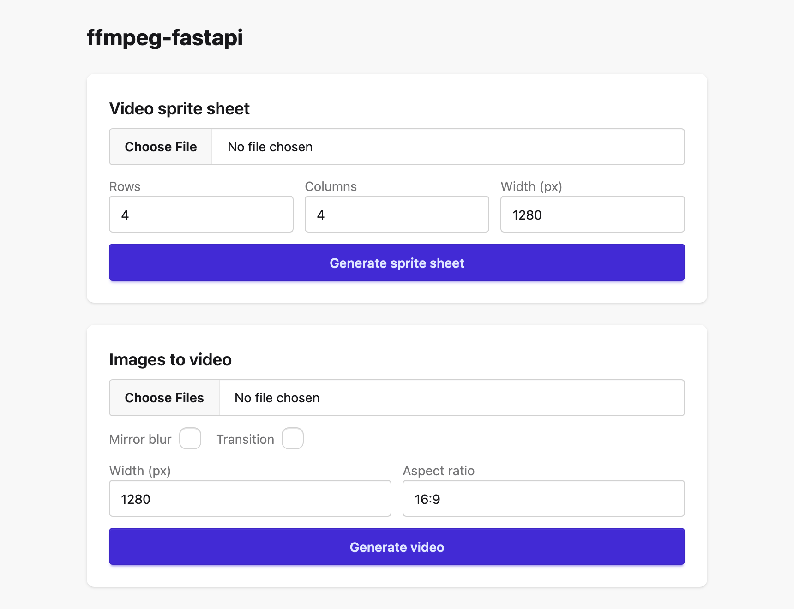

# FFmpeg FastAPI

A small, zero-install FastAPI service for fast ffmpeg-based media transforms. Prioritizes processing techniques that avoid decoding an entire video where possible.



## Requirements
- `ffmpeg` / `ffprobe` on `PATH`
- [`uv`](https://docs.astral.sh/uv/) (to run via `uvx`)

## Usage

```bash
uvx --from git+https://github.com/dev-ansung/ffmpeg-fastapi ffmpeg-fastapi
```

No install step, no config file, no database setup. The server picks a free port automatically and prints the URL to open, e.g.:

```
Serving at http://127.0.0.1:51234
```

Open that URL for the web UI, or call the JSON API directly.

## Features

### Video sprite sheet generation
Generates a single static image (jpg) tiling evenly-sampled thumbnails from a video, without decoding the full video.

- **Input**: video file
- **Parameters**: number of rows, number of columns, output image width
- **Output**: jpg sprite sheet

### Images to video conversion
Combines a sequence of images into an mp4 video.

- **Input**: image files
- **Parameters**: enable mirror blur (blurred background fill for mismatched aspect ratios), enable transition (crossfade between images), output video width, aspect ratio
- **Output**: mp4 video

## API

- `POST /api/jobs/{feature_name}` - submit a job (`feature_name` is `sprite` or `images_to_video`), multipart form body with the input file(s) and parameters above. Returns `{"job_id": "..."}`.
- `GET /api/jobs/{job_id}` - job status: `queued`, `running`, `done`, or `failed`.
- `GET /api/jobs/{job_id}/result` - downloads the completed output file.

## Storage

Uploads, outputs, and the job database live under a temp directory by default (override with `FFMPEG_FASTAPI_STATE_DIR`). Disk usage is capped at 5 GB by default (override with `FFMPEG_FASTAPI_MAX_STORAGE_MB`); once exceeded, the oldest completed jobs' files are deleted first.

## Development

```bash
uv sync --group dev
uv run ffmpeg-fastapi      # run the server locally
uv run pytest              # run the test suite
```

See [PLAN.md](PLAN.md) for the internal design.
